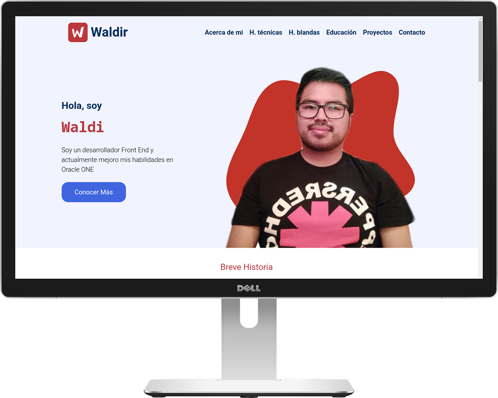

  
Waldir Maidana Valenzuela

  

  
### Índice  
- [Descripción del proyecto](#Descripción-del-proyecto) 
- [Funcionalidades del proyecto](#Funcionalidades-del-proyecto)  
- [Acceso al proyecto](#Acceso-al-proyecto)  
- [Tecnologías utilizadas](#Tecnologías-utilizadas)  
- [Autores](#Autores)  
## Descripción del proyecto  
Un portafolio personal al estilo landing page que muestra mi reseña, habilidades técnicas, habilidades blandas, educación, proyectos realizados y un formulario de contacto.  

  
## Funcionalidades del proyecto 
- `Funcionalidad 1:` Diseño mobile first
- `Funcionalidad 2:` Validación de formulario
- `Funcionalidad 2:` Animaciones según el scroll de la página
- `Funcionalidad 2:` Cabecera estática
## Acceso al proyecto
[Demo](https://zidjian.github.io/portafolio-wmv/)
## Tecnologías utilizadas
- JavaScript
- Html
- CSS
## Autores
| [ Waldir Maidana ](https://github.com/zidjian) |
| :---: |